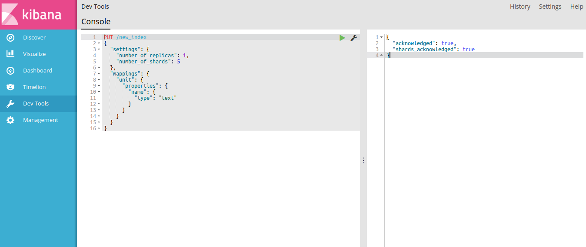

## Introduction

Một cách ngắn gọn, Elastic search là một cơ sở dữ liệu phân tán cho phép full-text search, truy vấn thông qua REST API. Dữ liệu được lưu dưới dạng JSON với cấu trúc linh hoạt (schema-free). Thưở ban đầu ES được dùng để lưu trữ text là chính nhưng đến nay nó được dùng cho nhiều loại dữ liệu khác nhau, như timeseries chẳng hạn, nói chung là rất mạnh.

ES được xây dựng dựa trên engine Apache Lucence và hiện là search engine cho doanh nghiệp phổ biến nhất thế giới, theo sau là Apache Solr, cũng là một engine dựa trên Lucence.

Stack của ES còn bao gồm một hệ phân tích log và thu thập dữ liệu là Logstash, cùng một anh chuyên visualize dữ liệu tên là Kibana. Thông thường để thử nghiệm nên cài ES cùng Kibana vì anh này có dev tool dùng để explore REST API rất tiện.



## Terminology

Dưới đây giải thích một vài thuật ngữ cơ bản của ES

**Document**

Một cách ngắn gọn, ES là một distributed document store. Các object thể hiện trên các ngôn ngữ khác nhau đều được serialize và lưu trữ dưới dạng document, cụ thể là JSON document. Chú ý rằng tuy gần giống nhau nhưng object mang đặc trưng của từng ngôn ngữ, cách tổ chức trong bộ nhớ cũng khác nhau, còn document là dạng đã được serialize, sử dụng một tiêu chuẩn chung để có thể trao đổi giữa các node, các ứng dụng.

```
// Object Javascript
{
  name: 'The song of Ice and Fire'
}
```
```
// JSON document
{
  "name": "The song of Ice and Fire
}
```

Đây là đơn vị lưu trữ cơ bản của ES. Do lịch sử vốn dùng để lưu trữ tài liệu văn bản nên cái tên này cũng không có gì lạ. Thể hiện của nó đơn giản là một đối tượng JSON. Có thể hiểu mỗi document như một row trong cơ sở dữ liệu quan hệ. Mỗi document sẽ có nhiều **field** và giá trị tương ứng. Cấu trúc của document mềm dẻo, không chặt như trong RDBMS. Document có thể lồng nhau.

**Index**

Là tập tất cả các document có liên quan đến nhau phục vụ cho việc tìm kiếm. Tương tự như database, nhưng không nên đồng nhất nó với database trong RDBMS. Ví dụ tôi có cơ sở dữ liệu của một công ty X, nhưng tôi có thể đánh chỉ mục các khách hàng, thông qua index `customer`, đồng thời, để tìm kiếm sản phẩm của công ty tôi đánh chỉ mục các sản phẩm, bằng index có tên là `product`.

Index phải có tên viết thường.

**Type**

Đây là một phần của index, bao gồm các document có chung field, ví dụ type `address` gồm các document là địa chỉ của các khách hàng ở công ty X.

**Shard, Replica**

Để hiểu được phần này cần giới thiệu sơ qua về cách phân chia mốt cơ sở dữ liệu phân tán. Hãy giả sử rằng bạn có một cơ sở dữ liệu lớn cỡ vài TB mà một máy dù có tài nguyên đủ lớn vẫn không handle được. Khi đó bạn buộc phải chia nhỏ nó ra và xử lý từng phần ở các máy khác nhau. Các phần nhỏ này được gọi là partition, còn công tác chia nhỏ gọi là partitioning.

Vậy chia như thế nào? Có 2 chiến thuật chính, theo chiều dọc và theo chiều ngang. Để dễ hiểu hãy tưởng tượng bạn có một cái bảng rất lớn và một cái kéo để chia nhỏ cái bảng này. Đúng như tên gọi, chia theo chiều dọc là cách chia thành nhiều phần gồm các cột khác nhau, còn chia theo chiều ngang thì các dòng khác nhau sẽ nằm trong các phần khác nhau. Như vậy có thể thấy cách chia theo chiều dọc mỗi document sẽ bị chia nhỏ, một số field thì nằm ở phần này, một số field nằm trong phần khác.

Sharding là cách chia theo chiều ngang. Mỗi phần, gọi là một shard sẽ chứa toàn bộ schema nên thuận lợi cho việc tìm kiếm. Ví dụ bảng của bạn có 1000 dòng chia làm 5 shard, mỗi shard 200 row thì mỗi tiến trình sẽ chỉ phải tìm kiếm trên 200 dòng, nhanh hơn nhiều việc tìm kiếm trên toàn bộ bảng.

Ngoài ra ES tự động phân chia dữ liệu trên các shard, tự động cân bằng lại các shard khi thêm xóa index, người dùng không cần quan tâm đến việc này.

Do đặc thù của một hệ phân tán, để đảm bảo tính tin cậy của hệ thống cần phải có dự phòng, đó là các replicas, hay tập trùng lặp. Các replica này sẽ giống hệt như các shard (gọi là primary shard) nhưng được dùng để thay thế cho chúng (primary shard) khi gặp lỗi.

> *Nhắc lại một chút về độ tin cậy*. Ví dụ bạn có 5 shard, mỗi shard đảm bảo uptime là 99.9%. Như vậy uptime của cả hệ là 99.9^5 = 99.5%, đồng nghĩa với việc mỗi năm bạn mất khoảng 43,8h ngồi chơi vì hệ thống lản ra chết.

**Node/cluster**

Cluster là một hệ gồm 1 hoặc nhiều server giữ toàn bộ index, mỗi server trong hệ gọi là một node. Bạn có thể đặt một hoặc nhiều shard trên cùng một node. Cluster có một định danh riêng, mặc định là elasticsearch

**Mappings**

Đây là quá trình định nghĩa kiểu dữ liệu của các field trong document để ES biết cách phải xử lý chúng như thế nào. Ví dụ: type text có thể áp dụng full-text search, type keyword mặc dù cũng là chuỗi nhưng search thì phải match hoàn toàn; type geolocation có thể dùng các điều kiện chuyên biệt như gần (near), hoặc nằm trong geobound...

Khi add document vào index, các field chưa nằm trong mapping sẽ được tự động đoán kiểu, việc này gọi là dynamic mapping.

**Analysis**

Khi một document được đánh chỉ mục, nội dung của nó cần được break thành các token, hay term để có thể  tìm kiếm full-text. Quá trình này gọi là analysis, mỗi chiến thuật analysis gọi là analyzer.

Có 2 thời điểm cần analysis:

- Khi đánh chỉ mục, cần phân tích nội dung văn bản, ví dụ nội dung văn bản HTML là `<p>The QUICK brown foxes jumped over the lazy dog!</p>`, html analyzer sẻ break thành `[quick, brown, fox, jump, over, lazi, dog]`

- Khi tìm kiếm, cần phân tích query tìm kiếm, ví dụ query `brown foxes` được standard analyzer index thành [brown, fox]

Ví dụ mapping và analyzer, dưới đây là setting của một index, vói chỉ địn kiểu analysis khác nhau khi index và khi search

```
{
  "settings": {
    "analysis": {
      "filter": {
        "autocomplete_filter": {
          "type": "edge_ngram",
          "min_gram": 1,
          "max_gram": 20
        }
      },
      "analyzer": {
        "autocomplete": {
          "type": "custom",
          "tokenizer": "standard",
          "filter": [
            "lowercase",
            "autocomplete_filter"
          ]
        }
      }
    }
  },
  "mappings": {
    "my_type": {
      "properties": {
        "text": {
          "type": "text",
          "analyzer": "autocomplete",
          "search_analyzer": "standard"
        }
      }
    }
  }
}
```
